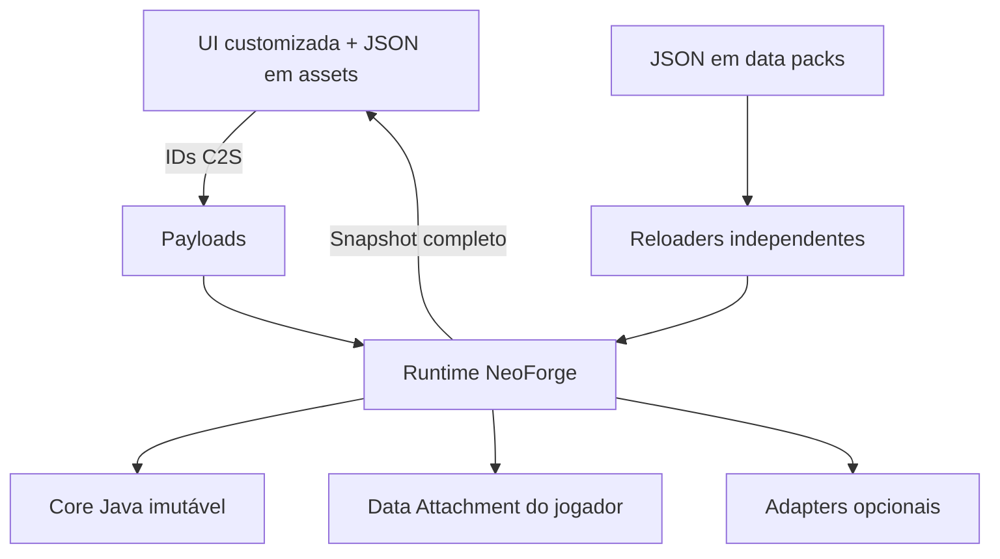

# AUDITORIA MESTRE — RPG Skill Tree

Auditoria realizada sobre o `main` no commit [`31377faa79685565b683923e9d8e2e62db073c92`](https://github.com/Gustavaopere/neoforge-rpg-skilltree/commit/31377faa79685565b683923e9d8e2e62db073c92), em 23/08/2026.

Nenhum arquivo do projeto foi alterado, nenhum commit foi criado e nenhum PR foi aberto.

## Veredito executivo

O projeto possui uma fundação aproveitável e não deve ser reescrito do zero. Há boas decisões já incorporadas:

- núcleo Java majoritariamente imutável e testável;
- servidor como autoridade;
- dados persistentes do jogador em Data Attachment;
- pacotes C2S contendo IDs em vez de estados arbitrários;
- integrações opcionais separadas por pacote;
- geração determinística dos dados atuais;
- inicialização bem-sucedida em dedicated server sem os mods opcionais.

Entretanto, o projeto ainda não está arquiteturalmente pronto para expansão de conteúdo. A inclusão de dezenas de novas skills, subárvores ou integrações agora multiplicaria inconsistências que já existem.

A prioridade correta é:

1. corrigir reconciliação e segurança de saves;
2. tornar as definições transacionais e realmente data-driven;
3. corrigir os atributos incompatíveis com 1.21.1;
4. eliminar a duplicação de regras entre cliente e servidor;
5. definir definitivamente classes, especializações, mastery e moedas;
6. somente então consolidar UI e integrações opcionais;
7. expandir conteúdo por último.

O CI verde atual prova compilação e inicialização básica; não prova que todas as skills funcionem dentro do jogo. O workflow do `main` passou no [run 32651628473](https://github.com/Gustavaopere/neoforge-rpg-skilltree/actions/runs/32651628473), mas os testes atuais não instanciam jogadores para verificar atributos, sync, reload, persistência real ou eventos dos provedores.

---

# 1. Escopo e inventário

## Snapshot auditado

| ItemEstado           |                                                                |
| -------------------- | -------------------------------------------------------------- |
| Branch               | `main`                                                         |
| Commit               | `31377faa79685565b683923e9d8e2e62db073c92`                     |
| Versão do mod        | `1.0.0-alpha.6-dev`                                            |
| Minecraft            | `1.21.1`, range `[1.21.1,1.21.2)`                              |
| NeoForge             | `21.1.248`                                                     |
| NeoGradle UserDev    | `7.1.26`                                                       |
| Java                 | 21                                                             |
| Gradle usado pelo CI | 8.14                                                           |
| Mappings             | Parchment `2024.11.17` para Minecraft 1.21.1                   |
| Arquivos             | 847                                                            |
| Java                 | 169 arquivos, aproximadamente 9.257 linhas no código principal |
| JSON                 | 634                                                            |
| Testes Java          | 18 executáveis por `main`, não JUnit                           |
| GameTests            | inexistentes                                                   |
| Gradle Wrapper       | inexistente                                                    |

A configuração pode ser conferida em [`gradle.properties`](https://github.com/Gustavaopere/neoforge-rpg-skilltree/blob/31377faa79685565b683923e9d8e2e62db073c92/gradle.properties), [`build.gradle`](https://github.com/Gustavaopere/neoforge-rpg-skilltree/blob/31377faa79685565b683923e9d8e2e62db073c92/build.gradle) e no [workflow atual](https://github.com/Gustavaopere/neoforge-rpg-skilltree/blob/31377faa79685565b683923e9d8e2e62db073c92/.github/workflows/alpha2-build.yml).

## Dependências opcionais compiladas

| IntegraçãoVersão configuradaEstado real |                                     |                                                |
| --------------------------------------- | ----------------------------------- | ---------------------------------------------- |
| Iron’s Spellbooks                       | `3.16.3`                            | Parcialmente integrada                         |
| Ars Nouveau                             | artefato `5.13.0`                   | Parcialmente integrada                         |
| Epic Fight                              | `21.17.3.1`                         | Parcialmente integrada                         |
| Goety                                   | `3.1.4`                             | Parcialmente integrada                         |
| Malum                                   | `1.8.2`                             | Parcialmente integrada                         |
| Eidolon                                 | `0.5.0.2`                           | Parcialmente integrada                         |
| Identity/Morph                          | sem dependência compilada principal | Mixin opcional frágil                          |
| Create                                  | ausente                             | Apenas políticas/dados preliminares            |
| AE2                                     | ausente                             | Gateway sem fonte de mastery                   |
| Oritech                                 | ausente                             | Gateway sem fonte de mastery                   |
| Curios                                  | ausente                             | Apenas modelo puro de attunement               |
| Passive Skill Tree                      | ausente                             | A arquitetura documentada não foi implementada |

As dependências são `compileOnly`/isoladas, mas não aparecem corretamente como dependências opcionais com versão e ordering no `neoforge.mods.toml`. A documentação oficial de 1.21.1 prevê `type = "optional"` para isso. [Documentação de mod files do NeoForge 1.21.1](https://docs.neoforged.net/docs/1.21.1/gettingstarted/modfiles).

## Conteúdo encontrado

No servidor:

- 512 nós na árvore principal gerada;
- 578 nós considerando todas as subárvores carregadas;
- 901 arestas no total;
- 119 efeitos de atributo, associados a 109 nós;
- 83 descritores semânticos de árvores;
- 26 classes;
- 25 especializações;
- 10 arquétipos;
- boss rewards, choices, morphs, blueprints e gateways.

No cliente:

- 568 nós;
- 893 arestas;
- dez nós de Eidolon presentes apenas no servidor;
- regras duplicadas em arquivos de `assets`, não derivadas da projeção efetiva do servidor.

A geração do `main` foi repetida em clone temporário: produziu os mesmos arquivos e deixou o working tree limpo. Todos os validadores Python atuais passaram.

---

# 2. Arquitetura atual



O desenho tem uma base saudável, mas dois problemas estruturais:

1. As regras de gameplay são lidas separadamente no servidor e duplicadas no cliente.
2. Os reloaders publicam catálogos independentes, sem validação e commit atômicos do conjunto.

Isso permite que:

- cliente e servidor apresentem resultados diferentes;
- um reload publique metade de uma nova configuração;
- referências entre nós, classes, efeitos e especializações fiquem inválidas;
- jogadores online continuem com efeitos antigos após reload;
- o cliente exiba uma compra como válida que o servidor rejeita.

A arquitetura recomendada deve convergir para um único `ProgressionDefinitionBundle` efetivo no servidor, validado integralmente e projetado para o cliente.

---

# 3. Estado da implementação

## 3.1 O que já está implementado e funcionando

“Funcionando” aqui significa coberto pelo core atual, geração/validação ou pelo smoke test do servidor — não necessariamente validado em gameplay completo.

- Progressão de XP e curva de nível.
- Ledger de pontos passivos.
- Compra e respec básico de nós.
- Mastery XP armazenado separadamente.
- Descobertas e first-credit de bosses.
- Choices e parte dos unlocks de classe.
- Persistência do jogador usando Data Attachment.
- `copyOnDeath` configurado.
- Codec binário versionado de `ProgressionState`, com leitura de versões 1 a 4.
- Limites de tamanho, rejeição de duplicatas, negativos e trailing data no codec.
- Payloads direcionais C2S/S2C.
- Servidor revalida ID, custos, requisitos e grafo antes de mutar estado.
- UI customizada para árvore principal e algumas subárvores.
- Aplicação de modifiers de atributo com IDs estáveis.
- Boss rewards por primeira derrota.
- Detecção de dimensão/bioma explorado.
- Integrações parciais com Iron’s, Ars, Epic Fight, Goety, Malum e Eidolon.
- Inicialização de dedicated server sem mods opcionais.
- Geradores e validadores determinísticos no `main`.
- Separação física razoável entre `core`, `runtime`, `client`, `data` e `compat`.

## 3.2 O que está parcialmente implementado

- Arquétipos emergentes: existem modelos e resolver, mas eles não dirigem o estado vivo do jogador.
- Especializações: existem classes, resolvers e 25 JSONs, porém o runtime principal não as carrega/resolve integralmente.
- Atributos canônicos: `CanonicalStatCatalog` e `ModifierResolver` existem, mas o runtime aplica diretamente os IDs brutos dos JSONs.
- Árvore semântica: 83 descritores são carregados, mas não dirigem a árvore comprável.
- Progressão por uso: vários eventos concedem mastery, porém sem contrato central de origem, confirmação e anti-farm.
- Gateways: requisitos existem, mas vários gateways são inalcançáveis porque não existe produtor para o mastery exigido.
- Classes híbridas: há bridge classes, mas o mecanismo ainda é predominantemente unlock persistido, não resultado emergente da distribuição de investimentos.
- Morph/Druid: há política e mixin; o PR de fundação propõe ecologia melhor, mas está vermelho.
- Attunement/Curios: existe somente o planner puro.
- Reload de dados: recarrega catálogos, mas não reconcilia corretamente jogadores online nem o cliente.
- Compatibilidade com addons: os arquivos são data-driven, mas IDs internos não são consistentemente namespaced.

## 3.3 O que foi iniciado de forma errada ou frágil

- Duas implementações concorrentes do modelo de classes:
  - `ArchetypeResolver`/`InvestmentState`;
  - `ClassProgressionState` persistido e unlocks JSON.
- Regras de gameplay duplicadas em `data` e `assets`.
- Aplicação de atributos ignorando o catálogo canônico.
- Reloaders independentes sem transação.
- Integrações baseadas em “intenção” quando deveriam confirmar o resultado do provedor.
- Mixin opcional do Identity contra método e assinatura específicos.
- Rastreamento global de ores colocados por posição usando `SavedData`.
- Mesmo codec conceitual usado como base para disco e rede.
- Specialization IDs, mastery IDs e class IDs como strings livres, enquanto nós usam `ResourceLocation`.
- Enums persistidos fechados em uma arquitetura que deveria aceitar addons.
- Abstrações de arquitetura criadas antes de existir ligação com o estado real: `TreeUnlockResolver`, `ArchetypeResolver`, parte de `IntegrationAdapter` e catálogo canônico.

## 3.4 O que ainda não existe

- Integração real com Passive Skill Tree.
- Definição única e transacional do conjunto de progressão.
- Projeção de regras do servidor para o cliente.
- Moedas de pontos específicas por subárvore.
- Modelo definitivo de classe primária/secundária/híbrida.
- Migrações semânticas separadas da versão binária.
- Recuperação ou quarentena de save corrompido.
- API pública estável para outros mods consultarem progressão.
- Integração real com Create.
- Integrações AE2 e Oritech.
- Integração Curios/Data Components para itens attuned.
- GameTests.
- Testes JUnit executados pelo task `test`.
- Testes de login/logout, morte, reload e sync.
- Testes de cliente.
- Matriz de CI com mods opcionais.
- Datagen nativo NeoForge.
- Workflow de release.
- Rate limiting de payloads.
- Métricas ou diagnóstico para integrações silenciosamente desativadas.

## 3.5 O que deve ser refatorado antes de novas features

- Reconciliação de especializações.
- Reconciliação de nós removidos.
- Codec/migrações e política de recuperação.
- IDs namespaced.
- Bundle transacional de definições.
- Fonte única servidor→cliente.
- Binding de atributos canônicos.
- Semântica de classe/especialização.
- Separação de moedas gerais e específicas.
- Lifecycle de modifiers e sync incremental.
- Contrato central para integrações opcionais.
- CI para detectar geração stale.
- Testes de runtime real.

## 3.6 O que não deve ser refatorado agora

- O core imutável e os value objects só por preferência estética.
- A escolha de Data Attachment para dados persistentes do jogador.
- O princípio de servidor autoritativo.
- Os payloads C2S que enviam apenas IDs.
- A separação atual por pacotes `compat`.
- A semântica de first-credit de bosses.
- A estratégia de IDs estáveis para attribute modifiers.
- Os geradores Python apenas para “ficar mais elegante”.
- A UI inteira antes da decisão sobre Passive Skill Tree.
- Arquivos minificados somente por estilo.
- Todo o projeto para uma estrutura multi-module imediatamente.

---

# 4. Bloqueadores concretos

## BLOQUEADOR 1 — Reconciliação apaga especializações

`ProgressionService.reconcileNodeSpecializations` começa de um estado vazio e repõe somente especializações derivadas dos nós atuais.

Consequência:

- qualquer especialização obtida por outra fonte pode ser apagada em login, compra, respec ou reconciliação;
- futura especialização de mod opcional é vulnerável;
- há perda lógica silenciosa de dados.

O [PR #5](https://github.com/Gustavaopere/neoforge-rpg-skilltree/pull/5) corrige a direção geral, preservando especializações não pertencentes a nós. Porém seu teste atual ainda espera o comportamento destrutivo antigo, deixando o PR vermelho.

## BLOQUEADOR 2 — Nós desconhecidos não podem ser reconciliados

O fluxo atual detecta que um nó aprendido não possui mais definição e tenta removê-lo chamando o respec normal.

O respec normal, por sua vez, exige que as definições de todos os nós aprendidos existam. Portanto:

1. a reconciliação detecta o nó ausente;
2. chama uma operação que não sabe processar nós ausentes;
3. a operação falha;
4. o login/reload pode terminar em exceção.

Isso é especialmente grave para:

- remoção ou renomeação de skills;
- desinstalação de addons;
- rollback de datapack;
- migrations;
- saves vindos de versões antigas.

É necessário um caminho administrativo de reconciliação separado da regra de respec voluntário.

## BLOQUEADOR 3 — Atributos de Minecraft 1.21.2 usados em 1.21.1

Foram encontradas 34 ocorrências de IDs vanilla sem o prefixo `generic.`:

- `minecraft:armor`;
- `minecraft:attack_damage`;
- `minecraft:attack_speed`;
- `minecraft:knockback_resistance`;
- `minecraft:luck`;
- `minecraft:max_health`;
- `minecraft:movement_speed`.

A remoção de prefixos como `generic.`, `player.` e `zombie.` ocorreu em **Minecraft 1.21.2**, conforme o changelog oficial da Mojang. Portanto, no alvo 1.21.1, devem ser usados IDs como `minecraft:generic.max_health` e `minecraft:generic.movement_speed`. [Notas oficiais de Minecraft 1.21.2](https://www.minecraft.net/nb-no/article/minecraft-java-edition-1-21-2).

O runtime atual ignora silenciosamente um atributo que não existe no registry. Assim, essas 34 entradas provavelmente não produzem efeito no alvo real, mesmo com CI verde.

## BLOQUEADOR 4 — Cliente e servidor usam contratos diferentes

Exemplos:

- servidor tem 578 nós; cliente, 568;
- dez nós de Eidolon não aparecem no cliente;
- o loader do cliente usa uma forma mais antiga de `NodeAccessRequirement`;
- `requiredNodes` e `requiredDiscoveries` não são considerados corretamente na projeção do cliente;
- classes e choices são exportados separadamente;
- o servidor pode rejeitar uma compra exibida como válida no cliente.

O servidor continuar rejeitando é correto para segurança, mas UX, sync e manutenção ficam frágeis.

## BLOQUEADOR 5 — PR de fundação não está integrável

O PR #5:

- tem 57 commits;
- altera 58 arquivos;
- tenta corrigir classes/especializações, morph e loaders;
- falha no teste de reconciliação;
- após rodar os geradores, deixa dezenas de alterações geradas não commitadas.

Seu [workflow 32661293366](https://github.com/Gustavaopere/neoforge-rpg-skilltree/actions/runs/32661293366) falha com:

```text
expected=[create_kinetics]
actual=[stale_spec, create_kinetics]
```

O `actual` representa a nova semântica desejável — preservar a especialização externa — mas o teste ainda afirma a semântica antiga.

Além disso, o CI executa apenas:

```bash
git diff --check
```

Esse comando detecta whitespace inválido, não arquivos gerados desatualizados. O correto é adicionar:

```bash
git diff --exit-code
```

Sem isso, o CI pode construir um JAR com conteúdo regenerado que não corresponde ao commit revisado.

---
