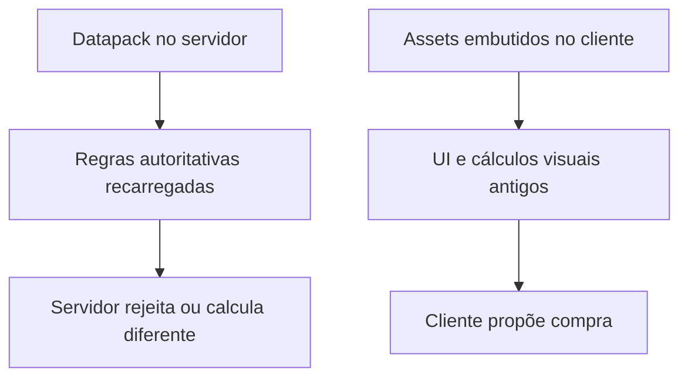
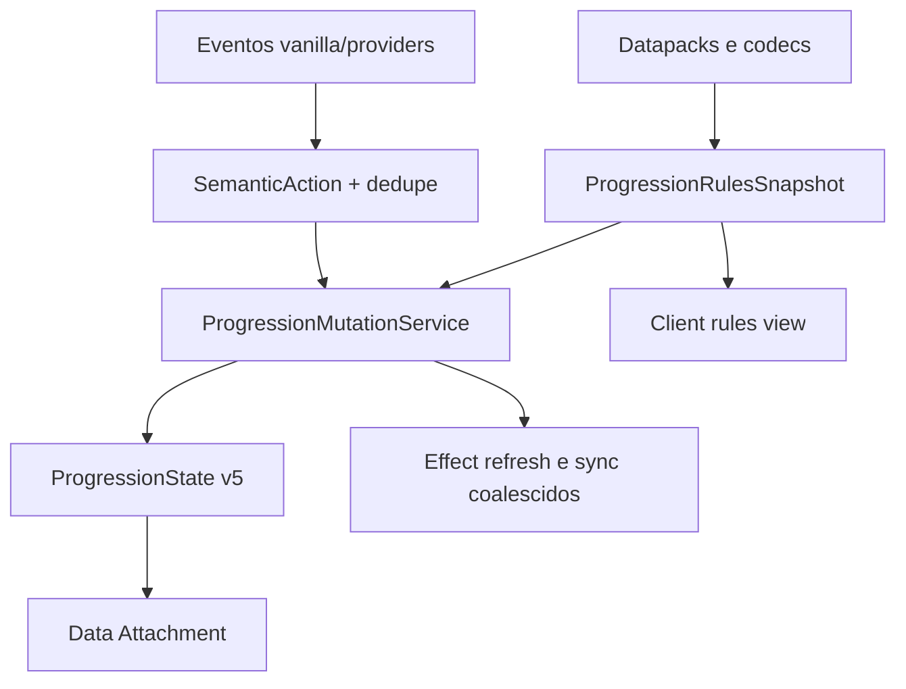

# AUDITORIA MESTRE — NeoForge RPG Skill Tree

## Veredito executivo

O projeto tem uma fundação técnica consideravelmente melhor do que o rótulo “alpha” sugere: compila, gera JAR, inicia em dedicated server, possui um núcleo Java separado, progressão autoritativa no servidor, persistência versionada e integração condicional com vários mods.

Porém, ele ainda não está pronto para receber grandes volumes de skills ou novas integrações. Existem falhas fundacionais que precisam ser corrigidas primeiro:

1. Há recursos incompatíveis com Minecraft 1.21.1: tag de bosses no diretório incorreto e IDs de atributos misturando convenções de versões posteriores.
2. Regras de progressão podem divergir entre servidor e cliente após datapacks ou `/reload`.
3. O modelo atual de persistência não consegue remover/renomear nós nem mudar custos com segurança.
4. O sistema declarado de atributos canônicos ainda não é o sistema realmente aplicado em runtime.
5. Eventos frequentes podem provocar recomputação completa de atributos e envio do estado completo do jogador.
6. A proteção contra XP duplicado entre integrações existe em classes isoladas, mas não está conectada ao fluxo real.
7. A arquitetura de classes emergentes, mastery e subárvores está bem descrita e parcialmente modelada, mas ainda não é a arquitetura efetivamente jogável.
8. A cobertura atual é majoritariamente estrutural. Não há GameTests, testes multiplayer, testes reais de reload/persistência nem execução automatizada do cliente.
9. A decisão mais importante de UI continua aberta: integrar/estender o mecanismo do Passive Skill Tree ou assumir formalmente uma implementação própria.

Minha recomendação é congelar a adição de conteúdo e executar primeiro as fases 0–5 do plano abaixo. Classes emergentes, mastery jogável, gateways e novas integrações devem entrar somente depois dessas fundações.

Nenhum arquivo foi alterado. Nenhum commit ou PR foi criado.

---

## Escopo e evidência examinada

A auditoria foi feita sobre o commit:

[`87a8ef224af52e1a613bce892a5f3e6732691466`](https://github.com/Gustavaopere/neoforge-rpg-skilltree/tree/87a8ef224af52e1a613bce892a5f3e6732691466)

Baseline identificado:

| ItemEstado           |                                                  |
| -------------------- | ------------------------------------------------ |
| Minecraft            | `1.21.1`, com faixa `[1.21.1,1.21.2)`            |
| NeoForge             | `21.1.248`                                       |
| Java                 | 21                                               |
| NeoGradle            | UserDev `7.1.26`                                 |
| Mappings             | Parchment para MC `1.21.1`, release `2024.11.17` |
| Versão do mod        | `1.0.0-alpha.6-dev`                              |
| Gradle usado na CI   | `8.14`                                           |
| Gradle Wrapper       | Ausente                                          |
| Código principal     | 166 arquivos Java, aproximadamente 8.600 linhas  |
| Testes Java          | 23 arquivos, aproximadamente 2.549 linhas        |
| Resources            | 628 arquivos, sendo aproximadamente 626 JSON     |
| Scripts auxiliares   | 14 Python e 1 shell                              |
| JUnit                | Ausente                                          |
| GameTests            | Ausentes                                         |
| Datagen NeoForge     | Nenhum provider implementado                     |
| GitHub Actions       | Um workflow de build/verificação                 |
| JAR/dedicated server | Verificados com sucesso no commit auditado       |

A execução de CI correspondente ao commit passou por build, validações, verificação do JAR e inicialização de dedicated server: [GitHub Actions run 32665893777](https://github.com/Gustavaopere/neoforge-rpg-skilltree/actions/runs/32665893777).

Os validadores read-only do repositório também passaram e reportaram:

- 7 arquétipos;
- 23 classes;
- 25 especializações;
- 5 pactos;
- 15 gateways;
- 512 nós da árvore principal;
- 835 arestas;
- 83 definições semânticas de árvore;
- 33 tríades;
- 119 efeitos para 109 nós;
- 11 overrides de morph;
- 23 mapeamentos ecológicos;
- 11 relações de facção.

Isso comprova consistência estrutural dos dados atuais, mas não comprova funcionamento comportamental completo no jogo.

---

# Estado atual da implementação

## 1. Implementado e sustentado por evidência

### Build e carregamento

- Build NeoForge completo no Java 21.
- JAR verificável.
- Inicialização em dedicated server sem os providers opcionais.
- Separação física do subscriber cliente, reduzindo risco de carregar classes client-only no servidor.
- Registro condicional das integrações `compileOnly`.

### Núcleo de progressão

- Núcleo Java razoavelmente independente de Minecraft.
- Estado imutável e serialização determinística.
- Migrações de estado v1 → v4.
- Rejeição de dados inválidos como valores negativos, duplicados e trailing bytes.
- Compra e respec centralizados no servidor.
- Revalidação no login e respawn.
- Cálculo de custo, rank e pré-requisitos no servidor, sem confiar em custos enviados pelo cliente.

### Persistência NeoForge

O uso de Data Attachments para estado persistente do jogador é apropriado para NeoForge 1.21.1. O projeto usa registro em `ATTACHMENT_TYPES`, serializer próprio e política de cópia na morte.

Isso está alinhado à separação recomendada:

- Data Attachments para dados associados a jogador/entidade;
- Data Components para estado persistente de `ItemStack`;
- capabilities para interfaces comportamentais e interoperabilidade;
- `SavedData` para estado do nível/dimensão.

Referências oficiais: [Data Attachments](https://docs.neoforged.net/docs/1.21.1/datastorage/attachments/), [Data Components](https://docs.neoforged.net/docs/1.21.1/items/datacomponents/), [Capabilities](https://docs.neoforged.net/docs/1.21.1/inventories/capabilities/).

### Networking e segurança básica

- Payloads C2S carregam intenções e IDs, não resultados finais confiáveis.
- O servidor recalcula disponibilidade, custo e requisitos.
- Sync direcionado ao proprietário do estado.
- Tentativas inválidas são rejeitadas.
- A separação conceitual entre estado persistente, regras e interface já existe.

O padrão geral está correto para [payload networking em NeoForge 1.21.1](https://docs.neoforged.net/docs/1.21.1/networking/payload/).

### Integrações existentes

Existem adapters condicionais para:

- Iron’s Spells ’n Spellbooks;
- Ars Nouveau;
- Epic Fight;
- Goety;
- Malum;
- Eidolon;
- Identity/morph.

Pontos positivos específicos:

- uso de recursos nativos de alguns providers, como Soul, mana e stamina;
- correlação específica de intent/resultado no Goety;
- confirmação de conclusão em fluxos do Eidolon;
- dependências `compileOnly`, evitando hard link do core;
- servidor base inicia sem os providers.

### Recursos e validação

- Grande volume de JSON organizado por domínio.
- Validadores para grafos, efeitos, gateways e exports.
- Export estrutural para o modelo passivo.
- Migrações semânticas existentes para IDs antigos de Industrialist, Logistician e Prospector.

---

## 2. Parcialmente implementado

### Classes emergentes e híbridas

Existem:

- arquétipos;
- especializações;
- regras de escolha;
- classes legadas;
- tríades;
- `InvestmentState`;
- `ArchetypeResolver`;
- catálogos de arquitetura e unlocks.

Mas o runtime ainda não deriva integralmente as classes a partir de contribuições dos nós comprados. Boa parte da experiência jogável continua apoiada no modelo legado de classes/tríades.

### Mastery

Há XP por uso, domínios e awards, porém faltam:

- níveis formais de mastery;
- ledger completo separado;
- pontos de especialista;
- políticas de caps;
- conversão determinística de mastery em unlocks;
- proteção central contra duplicidade entre providers;
- UI completa.

### Árvores semânticas e subárvores

Há 83 definições de árvores semânticas, mas poucas têm regras realmente jogáveis.

Conjuntos com regras observadas:

- árvore principal: 512 nós;
- Druid: 11;
- Metamorph: 10;
- Technomancer: 17;
- Warlock: 18;
- Eidolon Ritual: 5;
- Eidolon Theurgy: 5.

A UI expõe principalmente:

- main;
- technomancer;
- warlock;
- druid;
- metamorph.

Os dois conjuntos Eidolon existem nos dados, mas não estão plenamente expostos como experiência navegável.

### Efeitos

Dos 512 nós da árvore principal, somente cerca de 66 possuem efeito de atributo direto. Alguns dos demais são corretamente estruturais, conectores ou gateways, mas grande parte ainda funciona como placeholder de conteúdo.

Cobertura aproximada observada:

| Árvore | Nós | Nós com efeitos aproximados |
| --- | ---: | ---: |
| Main | 512 | 66 |
| Technomancer | 17 | 14 |
| Warlock | 18 | 17 |
| Druid | 11 | 7 |
| Metamorph | 10 | 5 |

Portanto “512 nós válidos” não equivale a “512 skills funcionalmente concluídas”.

### Datagen

O projeto possui geração própria via Python e uma configuração `runs.data`, mas não possui providers de datagen NeoForge registrados. A geração atual é externa ao lifecycle normal do mod.

### UI

Há uma tela customizada funcional como visualizador inicial, mas ainda faltam:

- catálogo de regras entregue pelo servidor;
- revisão de recursos no reload;
- navegação formal por gateways;
- breadcrumbs;
- mastery e pontos especializados;
- estados indisponíveis explicados;
- suporte coerente para datapacks;
- decisão sobre o mecanismo do Passive Skill Tree.

---

## 3. Iniciado, mas arquiteturalmente frágil ou incorreto

### P0 — Tag de bosses no caminho errado

O arquivo está em:

```text
data/rpgskilltree/tags/entity_types/bosses.json
```

Para Minecraft 1.21, as pastas de registries e tags foram singularizadas. O caminho correto é:

```text
data/rpgskilltree/tags/entity_type/bosses.json
```

A mudança está documentada no [primer oficial de migração para 1.21](https://github.com/neoforged/.github/blob/main/primers/1.21/index.md#depluralizing-registry-and-tag-folders).

Consequências:

- a tag atual não é carregada como tag de entidade;
- detecção de bosses baseada nela não funciona;
- somente caminhos alternativos, como detecção NBT de Apothic, podem estar cobrindo parte do problema;
- o validador `verify-runtime-scaffold.py` espera o caminho plural incorreto e, portanto, institucionaliza o bug.

Além disso, as entradas de Cataclysm precisam ser opcionais com `required: false`, ou Cataclysm precisa ser declarado obrigatório. Após corrigir o diretório, referências obrigatórias a entidades ausentes podem causar erro de carregamento do datapack.

### P0 — IDs de atributos incompatíveis com o alvo

Os dados misturam IDs como:

```text
minecraft:generic.max_health
minecraft:generic.armor
```

com formas posteriores como:

```text
minecraft:max_health
minecraft:armor
```

Para o alvo 1.21.1, devem ser usados os IDs compatíveis com essa versão, incluindo a forma `minecraft:generic.*` para os atributos vanilla correspondentes. Mesmo a documentação de 1.21.4 ainda apresenta a convenção `generic.*`: [atributos de LivingEntity](https://docs.neoforged.net/docs/1.21.4/entities/livingentity/).

O problema é agravado porque `AttributeNodeEffectRuntime` tenta resolver o registro e simplesmente ignora o efeito quando não encontra um holder. Assim, um nó pode:

- ser comprado;
- gastar pontos;
- aparecer como ativo;
- não aplicar efeito;
- não gerar erro útil.

O validador atual apenas confere formato/valor finito, não a existência real do atributo no registry da versão alvo.

### P0 — Regras diferentes no servidor e no cliente

O servidor carrega catálogos via reload de datapacks. O cliente carrega diversos dados estaticamente a partir de `/assets/...` com `getResourceAsStream`.

Isso permite esta divergência:



A segurança básica continua preservada, porque o servidor decide. Porém:

- a UI pode mentir sobre custos e requisitos;
- datapacks não conseguem alterar a experiência visual de modo coerente;
- `/reload` pode alterar a autoridade sem atualizar jogadores conectados;
- catálogos estáticos não participam do reload do `ResourceManager`.

### P0 — Remoção/renomeação de nós pode quebrar reconciliação

`reconcileInvalidNodes` identifica nós aprendidos sem definição como inválidos. Em seguida, `respecNode` depende de a definição do próprio nó existir para poder removê-lo.

Isso cria um dead-end:

1. uma versão ou datapack remove/renomeia um nó;
2. o save ainda contém esse nó;
3. a reconciliação o identifica como inválido;
4. o respec não consegue processá-lo porque a definição não existe.

Há também dois riscos econômicos:

- refund usa o custo atual da regra, não o custo realmente pago;
- redução de `maxRank` não tem reconciliação completa.

Alterar custos depois de um release pode criar ou destruir pontos.

### P1 — Catálogos recarregados sem snapshot atômico

Há vários reloaders independentes publicando catálogos `volatile`. Não há um único `ProgressionRulesSnapshot` validado e trocado atomicamente.

Durante reload, ou após falha parcial, combinações incompatíveis podem existir:

- node rules novos com efeitos antigos;
- árvore nova com gateways antigos;
- especialização referenciando definição inexistente;
- regra autoritativa nova com client view antiga.

Também não há reconciliação completa de todos os jogadores online após reload.

### P1 — Sistema canônico existe no core, mas não controla runtime

`CanonicalStatCatalog` e `ModifierResolver` existem, principalmente no core e nos testes. O runtime de atributos ainda lê IDs crus e aplica modificadores diretamente.

Faltam no fluxo efetivo:

- mapeamento `canonical stat → atributo do provider`;
- stacking group;
- ordem explícita de combinação;
- caps;
- validação de disponibilidade;
- erro em vez de silent no-op;
- binding alternativo quando um provider está ausente.

Isso impede que “atributos canônicos compartilhados” sejam uma garantia arquitetural real.

### P1 — Recomposição e sync excessivos

Mutações frequentes de XP/mastery chamam atualização do attachment, recompõem efeitos e enviam snapshot completo.

Eventos de alta frequência — hit, dodge, spell cast, skills do Epic Fight — podem gerar:

- O(número de efeitos) por ação;
- pacote completo por ação;
- remoção/reaplicação frequente de modifiers;
- custo crescente com quantidade de skills e jogadores.

Tentativas C2S inválidas também provocam full resync, o que pode ser usado como amplificador.

### P1 — Dedupe genérico não está conectado

`MasteryAward.sourceId` e `ProcGuard` existem, mas o fluxo real não utiliza ambos de maneira efetiva. Os adapters frequentemente criam `ActionOrigin` com `procDepth = 0`.

Não existe ainda um fingerprint central do evento, janela de deduplicação ou rastreamento de origem compartilhado entre providers.

Assim, o mesmo evento pode ser reconhecido por:

- evento vanilla;
- callback do mod;
- bridge/mixin;
- efeito secundário;

e conceder XP múltiplas vezes.

A correlação do Goety é uma implementação local válida, mas não equivale a uma política genérica de dedupe.

### P1 — Integrações opcionais podem produzir nós sem efeito

O mod inicia corretamente sem providers, mas a árvore principal referencia atributos de mods como Iron’s, Malum e Apothic.

Quando o provider não está presente:

- o nó continua potencialmente comprável;
- os pontos podem ser consumidos;
- o atributo não existe;
- o runtime ignora o efeito.

É preciso decidir entre:

1. baseline obrigatório de mods; ou
2. degradação realmente graciosa, removendo/bloqueando/substituindo esses nós.

Atualmente existe apenas load-safety, não gameplay-safety.

### P1 — Testes atuais não exercitam o mod como jogo

Os “testes Java” são classes com `main()`, compiladas por um script shell. Isso é útil para o core, mas não substitui:

- JUnit;
- GameTests;
- testes de attachment real;
- login/clone/respawn;
- payloads;
- datapack reload;
- atributos registrados;
- servidor com providers;
- duas conexões;
- teste cliente.

`verify-runtime-scaffold.py` verifica strings no código. `verify-runtime-contract.py` inclusive filtra falhas conhecidas de contratos legados. Esses scripts não comprovam comportamento em runtime.

O workflow também executa geração seguida de `git diff --check`. Esse comando só verifica problemas de whitespace; não detecta drift de conteúdo gerado. O gate correto é `git diff --exit-code`.

---

## 4. O que ainda não existe

- Modelo persistente v5 com custo pago e proveniência por rank.
- Snapshot atômico de todas as regras.
- Protocolo server → client para regras sanitizadas e revisionadas.
- Reconcile completo de jogadores online após reload.
- Sistema canônico aplicado em runtime.
- Política central de stacking/caps.
- Dedupe real entre eventos e providers.
- Rate limit/backpressure do C2S.
- JUnit integrado ao Gradle.
- GameTests.
- Testes multiplayer.
- Testes de client startup/UI.
- Testes com os providers carregados.
- Provider SPI normalizado.
- Pontos de especialização separados.
- Mastery levels formalizados.
- Mastery XP e árvore points com ledgers independentes completos.
- Gateways jogáveis com navegação entre árvores.
- Proveniência de unlock de especialização.
- Implementação jogável completa para Iron’s, Ars e Epic Fight.
- Integração runtime com Create.
- Integração real com o mecanismo/port de Passive Skill Tree.
- Datagen oficial NeoForge.
- Workflow de release.
- Artefato beta publicável.
- Arquivo de licença explícito, apesar da referência textual a GPL.
- Política documentada de compatibilidade de save/datapack.

---

## 5. O que deve ser refatorado antes de novas features

Em ordem:

1. Recursos e IDs específicos de 1.21.1.
2. Persistência de allocations e política econômica.
3. Snapshot atômico de regras e sync de catálogo ao cliente.
4. Runtime canônico de efeitos.
5. Pipeline único de mutação, recomposição e sync.
6. Dedupe e atribuição de ações.
7. Testes JUnit/GameTest e matriz de CI.
8. Arquitetura jogável de classes, mastery e gateways.
9. Decisão do engine de UI.
10. Provider SPI e endurecimento das integrações.

---

## 6. O que não deve ser refatorado agora

Não há justificativa para estas mudanças neste momento:

- substituir Data Attachments por capabilities;
- eliminar o núcleo Java imutável;
- mover a autoridade de compra para o cliente;
- sincronizar estado privado para todos os jogadores;
- fundir grafo de compra e arquitetura semântica;
- persistir modifiers de atributo em vez de reconstruí-los;
- apagar migrações v1–v4;
- tornar todas as integrações obrigatórias;
- dividir imediatamente o projeto em muitos JARs publicados;
- reescrever todos os parsers Gson apenas por elegância;
- trocar todos os nomes/pacotes sem ganho funcional;
- otimizar o renderer dos 512 nós antes de profiling;
- polir extensivamente a UI atual antes da decisão sobre Passive Skill Tree.

Essas alterações seriam cosméticas ou criariam risco sem resolver os bloqueadores reais.

---

# Achados por subsistema

## Registries e lifecycle

O bootstrap principal é funcional, mas precisa de um contrato mais rígido:

- todos os registries devem ser registrados no mod event bus;
- reload listeners devem construir um snapshot candidato completo;
- somente um snapshot integralmente válido pode substituir o anterior;
- falha de reload deve conservar o último snapshot bom;
- o reload bem-sucedido deve reconciliar jogadores online;
- catálogos cliente não podem ser singletons de classpath imunes ao resource reload.

## Player data e corrupção

O codec v4 é defensivo, porém a falha de decode é dura. Isso evita reset silencioso, mas pode impedir carregamento do jogador ou mundo sem mecanismo de recuperação.

Devem existir:

- diagnóstico com UUID e versão do payload;
- cópia/quarentena do blob inválido;
- comando administrativo de export;
- comando explícito de reset/recovery;
- nunca reset automático silencioso;
- limite de tamanho para collections;
- testes fuzz/property de dados truncados e corrompidos.

## Segurança client → server

A decisão autoritativa está correta. Faltam:

- rate limit por jogador e tipo de payload;
- limite de IDs/string/payload;
- rejeição sem full resync automático em toda tentativa inválida;
- contador/log agregado para spam;
- revisão de replay;
- atualização somente na server thread;
- validação de dimensão/distância quando ações futuras dependerem do mundo.

## Dedicated server

A separação atual é boa e o smoke passou. Ainda precisam ser testados:

- servidor sem nenhum provider;
- servidor com cada provider;
- servidor com mixins opcionais ausentes;
- login/respawn/death;
- `/reload`;
- datapack inválido;
- atualização de versão com save antigo.

## Performance

Pontos que merecem instrumentação:

- recomposição de todos os atributos por award;
- snapshot completo por evento;
- renderização de 512 nós;
- catálogos JSON carregados repetidamente;
- mapa de contribuidores de alquimia do Eidolon;
- `SavedData` de minérios colocados;
- histórico de efeitos “clearable” crescendo por reload;
- ausência de dedupe;
- scanning de nós e arestas durante compras.

Nenhuma otimização deve ser feita sem benchmark, exceto a eliminação óbvia de recomposição/full-sync por award.

## Player-placed ore tracking

O registro por posição em `SavedData` tem risco de crescimento permanente e inconsistência:

- pistons e máquinas movem blocos;
- WorldEdit e ações não originadas de `ServerPlayer` escapam;
- bloco removido por outro mecanismo pode deixar marcador;
- estado por dimensão pode crescer indefinidamente;
- mineração automatizada pode contornar a intenção.

Prefira, conforme o design final:

- marcação por chunk com limpeza;
- expiração/reconciliação;
- attachment/component no bloco quando possível;
- integração específica com break/place automation;
- ou uma heurística probabilística explicitamente assumida.

## Morph/Druid

- O gate por mixin `@Pseudo` para Identity pode falhar silenciosamente se o método mudar.
- O estado de hostilidade usa memória de sessão e relógio de parede.
- Reiniciar/reconectar pode contornar a restrição, se a intenção for persistência de gameplay.
- A documentação está defasada em relação à existência do veto.
- É necessária uma decisão sobre persistir ou não hostilidade.
- Mixin opcional crítico deve produzir diagnóstico claro quando o provider está presente, mas a injeção não foi aplicada.

## Integrações específicas

### Iron’s e Ars Nouveau

- Não tratam de maneira uniforme creative/spectator.
- Hooks pre-cast podem bloquear ações em modos que deveriam ignorar progressão.
- Existem adapters de mastery, mas não árvores especializadas completas.

### Epic Fight

- Alto potencial de eventos duplicados ou de alta frequência.
- Precisa de fingerprint/dedupe compartilhado.
- Stamina nativa é uma boa escolha e deve ser preservada.

### Goety

- Correlação intent → confirmação é boa.
- Cleanup no logout é correto.
- Deve ser adaptada ao futuro pipeline central, sem perder sua confirmação nativa.

### Eidolon

- Confirmação de conclusão é adequada.
- Tracking de contribuidores pode acumular durante sessões longas.
- Em interação multiplayer, “último contribuidor” pode atribuir resultado à pessoa errada.
- As árvores existem parcialmente nos dados, mas não na navegação normal.

### Malum

- Reflection amplia compatibilidade, mas exceções são silenciadas.
- API drift pode desligar o comportamento sem diagnóstico.
- Deve haver warning once-only e teste com a versão suportada.

### Identity

- Dependência opcional e mixin `@Pseudo` são razoáveis.
- É necessário teste com o mod realmente carregado.
- Deve haver estratégia fail-closed ou fail-visible para autorização.

### Create

Ainda não há integração runtime. Quando for implementada, deve observar resultados semânticos — receita concluída, contraption executada, milestone produtivo — e não conceder XP por tick de máquina.

---

# Arquitetura recomendada



## 1. Núcleo

Manter um núcleo Java puro contendo:

- IDs e valores imutáveis;
- grafos;
- requisitos;
- cálculos de custo;
- resolução de classes;
- ledger;
- mastery;
- migrações;
- codecs independentes quando possível;
- nenhuma referência a classes de providers.

## 2. `ProgressionRulesSnapshot`

Criar um snapshot imutável único contendo:

- node rules;
- edges;
- costs;
- node effects;
- contribution metadata;
- tree architecture;
- archetypes;
- specializations;
- gateways/unlocks;
- mastery definitions;
- provider requirements;
- canonical stat bindings;
- revision/hash;
- representação sanitizada para o cliente.

Processo:

1. parse de todos os recursos;
2. validação local;
3. validação cruzada;
4. resolução de aliases;
5. validação de providers;
6. construção do snapshot;
7. troca atômica;
8. reconcile e sync.

## 3. `ProgressionState v5`

Persistir fatos do jogador, não derivados:

- XP e nível base;
- ledger de pontos;
- allocations por nó/rank;
- custo efetivamente pago;
- proveniência da allocation;
- versão/revisão econômica;
- mastery XP por domínio;
- choices;
- unlocks externos quando realmente persistentes;
- discoveries.

Derivar:

- classe primária/secundária;
- classes híbridas;
- trees disponíveis;
- efeitos atuais;
- especializações emergentes;
- estado visual.

Estrutura conceitual de allocation:

```text
Allocation {
  nodeId
  rank
  paidCost
  currencyId
  sourceTreeId
  rulesVersion
}
```

## 4. `ProgressionMutationService`

Toda alteração deve passar por uma transação central:

```text
current state + rules snapshot + validated intent
    -> next state + audit result + dirty reasons
```

Dirty reasons:

- state sync;
- effects changed;
- class resolution changed;
- tree availability changed;
- mastery display changed.

Recomposição e networking devem ser coalescidos no máximo uma vez por tick por jogador, salvo resposta transacional que realmente exija confirmação imediata.

## 5. Atributos canônicos

O JSON não deve apontar arbitrariamente para registries crus em todo lugar.

Modelo recomendado:

```text
canonical:rpg.max_health
    -> vanilla minecraft:generic.max_health

canonical:rpg.spell_power
    -> irons_spellbooks:spell_power, se disponível

canonical:rpg.magic_resistance
    -> binding escolhido pelo ruleset/provider
```

Cada efeito precisa declarar:

- canonical stat;
- operação;
- stacking group;
- ordem;
- cap;
- política se provider ausente;
- origem/nó.

Um target ausente deve:

- invalidar a regra; ou
- tornar o nó indisponível com explicação; ou
- usar fallback documentado.

Nunca deve resultar em compra silenciosamente inútil.

## 6. Integrações

Uma integração deve produzir eventos normalizados:

```text
SemanticAction {
  actionId/fingerprint
  providerId
  actor
  tick
  actionType
  domain
  magnitude
  procDepth
  context
}
```

O pipeline central aplica:

- dedupe;
- cooldown;
- atribuição;
- anti-farm;
- caps;
- mastery;
- mutação.

Tipos de provider não devem aparecer no core.

Por enquanto, um único JAR com pacotes lógicos é suficiente. Subprojetos ou companion mods só devem ser criados se conflitos reais de dependência/classloading justificarem.

## 7. Cliente

O cliente recebe do servidor:

- snapshot sanitizado das regras;
- revision/hash;
- trees visíveis;
- custos;
- requisitos explicáveis;
- disponibilidade dos providers;
- estado do jogador.

O cliente envia apenas intenções:

- comprar;
- respec;
- escolher;
- navegar/solicitar detalhes quando necessário.

Assets locais devem ser exclusivamente visuais: ícones, texturas, traduções e layout não autoritativo.

## 8. Domínios extensíveis

`ProgressionDomain` é um enum, embora o objetivo fale em integrações opcionais futuras.

Há duas opções válidas:

- manter o enum como taxonomia macro fechada e documentar isso;
- migrar para IDs namespaced (`ResourceLocation`) registrados nos datapacks.

Se addons externos precisarem criar domínios próprios, o enum atual será bloqueador. Essa decisão deve ocorrer antes do schema v5.

---

# DECISÕES PENDENTES

1. **Engine da árvore:** integrar um port/licença/API real do Passive Skill Tree ou assumir oficialmente uma UI própria.
2. **Baseline de providers:** quais mods são obrigatórios e quais são genuinamente opcionais.
3. **Domínios:** enum fechado ou IDs namespaced extensíveis.
4. **Formato exato do `ProgressionState v5`.**
5. **Nós desconhecidos em saves v4:** quarentena, alias, refund ou manutenção invisível.
6. **Política de refund:** custo pago histórico, custo atual ou tabela de migração. Recomendação: custo pago histórico.
7. **Mudanças econômicas por datapack:** hot reload ou somente com versão/migração. Recomendação: não aplicar mudanças econômicas retroativas sem versão explícita.
8. **Artificer:** taxonomia e posição final; não ativar apenas porque já há JSON.
9. **Corredores físicos entre classes:** quais conexões substituem as sobretaxas legadas.
10. **Proveniência de especialização:** nós, mastery, integração externa ou combinação.
11. **Persistência da hostilidade de morph.**
12. **Política de falha para mixins opcionais de autorização.**
13. **Empacotamento:** um JAR lógico ou companion integrations no futuro.
14. **Create:** quais ações constituem “uso significativo” sem criar farm passivo.
15. **Limites e caps globais dos atributos canônicos.**

---

# PLANO MESTRE

## Fase 0 — Congelamento de decisões e baseline reproduzível

**Objetivo:** estabelecer ambiente de desenvolvimento/testes confiável antes de mexer em saves ou gameplay.

**Pré-requisitos:** nenhum.

**Arquivos/módulos afetados:**

- `build.gradle`;
- `settings.gradle`;
- `.github/workflows/**`;
- novos testes em `src/test/java`;
- configuração de GameTests;
- documentação/ADRs;
- scripts de geração.

**Implementação necessária:**

- adicionar Gradle Wrapper 8.14;
- integrar JUnit 5 ao Gradle;
- preservar os testes puros existentes, migrando-os gradualmente;
- configurar `runGameTestServer`;
- fazer a CI usar `./gradlew`;
- trocar o gate de geração por `git diff --exit-code`;
- aplicar timeouts e concorrência na CI;
- registrar ADRs para as decisões 1–7;
- criar regressões inicialmente falhas para tag, atributos e nó removido.

**Testes necessários:**

- build pelo wrapper;
- testes puros;
- inicialização de GameTestServer;
- validação de que geração não deixa diff;
- smoke de dedicated server.

**Critério de conclusão:**

- checkout limpo consegue executar todos os gates sem Gradle instalado globalmente;
- JUnit e GameTest tasks aparecem no Gradle;
- CI falha quando artefato gerado diverge;
- decisões arquiteturais bloqueadoras registradas.

**Riscos:** migração apressada dos testes shell pode perder cobertura.

**Dependências posteriores:** todas.

---

## Fase 1 — Correção estrita para Minecraft/NeoForge 1.21.1

**Objetivo:** eliminar erros de versão e silent no-op.

**Pré-requisitos:** fase 0.

**Arquivos/módulos afetados:**

- `data/rpgskilltree/tags/**`;
- JSONs de `node_effects`;
- `AttributeNodeEffectRuntime`;
- validadores Python;
- `ClientKeyMappings`;
- metadata e documentação.

**Implementação necessária:**

- renomear `tags/entity_types` para `tags/entity_type`;
- tornar entradas Cataclysm opcionais ou declarar dependência;
- substituir IDs vanilla posteriores pelos IDs de 1.21.1;
- validar targets contra o registry real;
- distinguir target ausente de provider ausente;
- remover silent skip;
- usar key mapping com `consumeClick` no client tick;
- alinhar versões do changelog, track e metadata.

**Testes necessários:**

- GameTest de boss tag;
- aplicação real de max health, armor e outros atributos;
- startup sem providers;
- startup com datapack contendo entradas opcionais;
- teste de tecla e desconexão cliente.

**Critério de conclusão:**

- nenhuma regra carregada referencia atributo vanilla inexistente;
- tag de bosses é resolvida em runtime;
- provider ausente não permite compra inútil;
- dedicated server permanece verde.

**Riscos:** corrigir IDs pode alterar builds existentes; preparar migração/nota.

**Dependências posteriores:** efeitos canônicos, integrações, conteúdo.

---

## Fase 2 — Persistência v5 e economia segura

**Objetivo:** permitir evolução de regras sem corromper saves ou pontos.

**Pré-requisitos:** fases 0–1 e decisões de schema/refund.

**Arquivos/módulos afetados:**

- `ProgressionState`;
- codec e migrations;
- `ProgressionService`;
- attachment serializer;
- comandos administrativos;
- aliases de IDs.

**Implementação necessária:**

- representar allocations com rank, custo pago, currency e proveniência;
- implementar migração v4 → v5;
- política para nó removido/renomeado;
- alias namespaced;
- reconcile para rank acima de `maxRank`;
- ledger separado por tipo de ponto;
- quarentena/export de estado inválido;
- recuperação administrativa explícita;
- limites de tamanho e versão.

**Testes necessários:**

- matriz v1 → v5;
- encode/decode determinístico;
- dados truncados e collections enormes;
- remoção, rename, redução de rank e mudança de custo;
- clone na morte, End return e respawn;
- refund pelo custo histórico;
- save corrompido sem reset silencioso.

**Critério de conclusão:**

- qualquer save v1–v4 migra determinísticamente;
- remover/renomear nó não bloqueia login;
- total de pontos é preservado segundo a política escolhida;
- há caminho administrativo de recuperação.

**Riscos:** é a fase com maior risco de compatibilidade. Exigir backup de saves.

**Dependências posteriores:** classes emergentes, mastery, gateways, releases.

---

## Fase 3 — Snapshot atômico, reload e autoridade visual

**Objetivo:** uma única versão coerente das regras para servidor e cliente.

**Pré-requisitos:** fase 2.

**Arquivos/módulos afetados:**

- reloaders/catálogos de dados;
- codecs;
- `NodeRulesReloader`;
- networking;
- catálogos cliente;
- `ClientProgressionState`;
- screen/layout.

**Implementação necessária:**

- criar `ProgressionRulesSnapshot`;
- validar referências cruzadas;
- trocar snapshot atomicamente;
- manter último snapshot bom em reload inválido;
- revision/hash;
- payload server → client com view sanitizada;
- reconcile dos jogadores online após reload;
- limpeza do estado cliente na desconexão;
- invalidar caches por revision.

**Testes necessários:**

- reload válido;
- reload inválido mantém snapshot anterior;
- alteração de custo aparece igual no cliente e servidor;
- remoção de efeito limpa modifier online;
- dois jogadores recebem apenas seus estados;
- cliente reconecta a servidor com regras diferentes.

**Critério de conclusão:**

- não existe catálogo gameplay-critical carregado estaticamente do classpath cliente;
- UI e servidor exibem a mesma revision;
- `/reload` não deixa estado misto;
- falha parcial não publica regras incompletas.

**Riscos:** payload de regras pode ser grande; usar limites, compactação ou sync por hash/delta se necessário.

**Dependências posteriores:** UI, datapacks, extensibilidade.

---

## Fase 4 — Runtime real de atributos canônicos

**Objetivo:** tornar o modelo canônico a única entrada de efeitos.

**Pré-requisitos:** fases 1 e 3.

**Arquivos/módulos afetados:**

- `CanonicalStatCatalog`;
- `ModifierResolver`;
- `AttributeNodeEffectRuntime`;
- `NodeEffectCatalog`;
- JSON/schema de efeitos;
- bindings de providers.

**Implementação necessária:**

- canonical IDs namespaced;
- bindings por target/provider;
- stacking groups;
- ordem das operações;
- caps;
- política de indisponibilidade;
- diagnóstico de target ausente;
- geração/revision dos modifiers;
- limpeza de modifiers antigos sem conjunto histórico ilimitado.

**Testes necessários:**

- resolução vanilla;
- provider presente/ausente;
- soma, multiplicação, ordem e caps;
- reload/remove/respec/death;
- colisão de modifier IDs;
- nós híbridos afetando a mesma stat.

**Critério de conclusão:**

- nenhum JSON gameplay-critical aplica registry ID cru fora da camada de binding;
- target ausente nunca é ignorado silenciosamente;
- recomposição produz resultado determinístico;
- todos os efeitos atuais têm binding válido ou indisponibilidade explícita.

**Riscos:** pode mudar balanceamento; gerar relatório antes/depois.

**Dependências posteriores:** todas as skills e integrações de atributos.

---

## Fase 5 — Pipeline de mutação, performance, dedupe e segurança

**Objetivo:** suportar gameplay de alta frequência e várias integrações sem duplicidade.

**Pré-requisitos:** fases 2–4.

**Arquivos/módulos afetados:**

- `PlayerProgressionRuntime`;
- payload handlers;
- award/mastery services;
- `ProcGuard`;
- adapters;
- effect refresh;
- sync scheduler.

**Implementação necessária:**

- `ProgressionMutationService` único;
- dirty flags;
- recomposição somente quando allocations/regras mudarem;
- sync coalescido por tick;
- delta ou snapshot somente quando necessário;
- rate limit por jogador/payload;
- fingerprint de `SemanticAction`;
- dedupe window;
- `procDepth` propagado;
- atribuição uniforme;
- métricas e logs agregados.

**Testes necessários:**

- spam de payload;
- replay;
- evento vanilla + provider duplicado;
- proc secundário;
- 100 jogadores simulados;
- milhares de awards sem recomposição de atributos;
- tamanho e frequência dos pacotes.

**Critério de conclusão:**

- XP/mastery simples não recompõe atributos;
- cada ação semântica concede reward no máximo uma vez;
- spam não causa full resync ilimitado;
- budgets de CPU/pacote documentados e atendidos.

**Riscos:** dedupe excessivo pode remover awards legítimos. Exigir fixtures por provider.

**Dependências posteriores:** mastery por uso, Create, combate e spellcasting.

---

## Fase 6 — Progressão emergente jogável

**Objetivo:** transformar os modelos existentes em arquitetura efetiva de classes híbridas.

**Pré-requisitos:** fases 2–5 e decisões de domínios/especializações.

**Arquivos/módulos afetados:**

- node rules;
- contribution metadata;
- `InvestmentState`;
- `ArchetypeResolver`;
- specializations;
- tree unlocks;
- mastery state;
- gateways;
- migrations de classes legadas.

**Implementação necessária:**

- cada allocation contribui para domínios;
- derivar primary/secondary sem hard lock;
- permitir híbridos;
- definir desempate determinístico;
- implementar corredores físicos entre regiões;
- migrar/remover sobretaxas legadas somente após os corredores existirem;
- mastery XP e pontos especializados separados;
- proveniência dos unlocks;
- gateways que abrem subárvores;
- domains namespaced se a decisão for extensibilidade aberta.

**Testes necessários:**

- jogador sem classe;
- mudança gradual de afinidade;
- híbridos;
- empate;
- classe secundária;
- especialização sem classe fixa;
- gasto de currency errada;
- gateway fechado/aberto;
- respec atravessando gateway;
- migração de classe legada.

**Critério de conclusão:**

- classes são resultado do investimento;
- nenhum hard lock global impede híbridos;
- mastery não consome pontos da árvore principal;
- subárvores exigem seus gateways e currency corretos;
- resultados são determinísticos no servidor.

**Riscos:** mudança profunda de gameplay; requer testes de balanceamento além dos técnicos.

**Dependências posteriores:** conteúdo especializado e UI final.

---

## Fase 7 — Engine e UX da árvore

**Objetivo:** construir a apresentação final sem duplicar regra autoritativa.

**Pré-requisitos:** fases 3 e 6; decisão do Passive Skill Tree.

**Arquivos/módulos afetados:**

- client screen;
- layout;
- icons/translations;
- networking de view;
- possível adapter para o engine externo.

**Implementação necessária:**

- verificar licença e API do port escolhido;
- integrar/estender o engine ou registrar ADR assumindo engine próprio;
- renderizar snapshot do servidor;
- navegação por portais;
- breadcrumbs;
- mastery e currencies;
- estados unavailable/provider missing;
- tooltips explicando requisitos;
- virtualização/culling se profiling justificar.

**Testes necessários:**

- client startup;
- resize/scaling;
- árvores grandes;
- navegação;
- reconexão;
- datapack override;
- provider ausente;
- screenshot/manual regression.

**Critério de conclusão:**

- UI nunca calcula autoridade independente;
- 512 nós permanecem navegáveis;
- portais e subárvores são compreensíveis;
- regras do datapack aparecem sem rebuild do cliente.

**Riscos:** licença/API do port pode inviabilizar integração.

**Dependências posteriores:** polish e conteúdo.

---

## Fase 8 — Provider SPI e endurecimento das integrações

**Objetivo:** tornar integrações opcionais sustentáveis.

**Pré-requisitos:** fases 4–7.

**Arquivos/módulos afetados:**

- `compat/**`;
- metadata opcional;
- provider bindings;
- mixins;
- matriz CI.

**Implementação necessária:**

- interface normalizada de provider;
- bridges para `SemanticAction`;
- policies uniformes para creative/spectator;
- warnings once-only;
- limpeza de caches;
- timeouts/expiração;
- testar APIs compile/runtime;
- declarar faixas de versão opcionais;
- fail-visible para mixins críticos.

**Testes necessários:**

- base sem provider;
- cada provider isolado;
- combinações principais;
- dedicated server e cliente;
- API incompatível;
- logout/reload;
- atribuição multiplayer.

**Critério de conclusão:**

- ausência de provider não quebra nem cria nó inútil;
- presença de provider habilita binding e testes;
- API drift gera erro acionável;
- nenhuma classe de provider vaza para o core.

**Riscos:** custo de CI e distribuição das dependências.

**Dependências posteriores:** expansão das integrações.

---

## Fase 9 — Conteúdo e novas integrações

**Objetivo:** expandir conteúdo apenas sobre fundações estáveis.

**Pré-requisitos:** fases 1–8.

**Ordem recomendada:**

1. completar árvores jogáveis de Iron’s, Ars e Epic Fight;
2. estabilizar Goety, Eidolon, Malum e Identity;
3. Create;
4. AE2/Oritech ou outros sistemas tecnológicos;
5. expansão Druid/Morph;
6. outros sistemas RPG.

**Implementação necessária:**

- skills com efeito real;
- native resource semantics;
- pontos/mastery próprios quando aplicável;
- gateways;
- disponibilidade;
- documentação e balanceamento.

**Testes necessários:**

- teste nativo por skill/integration;
- anti-farm;
- dedupe;
- respec;
- provider ausente;
- multiplayer;
- performance.

**Critério de conclusão:**

Uma integração só é “implementada” quando possui:

- conteúdo navegável;
- regras servidoras;
- efeitos;
- mastery;
- persistência;
- UI;
- testes com o provider real;
- comportamento seguro sem o provider.

**Riscos:** conteúdo mascarar falhas arquiteturais; evitar exceções ad hoc no core.

**Dependências posteriores:** beta.

---

## Fase 10 — Beta e release

**Objetivo:** produzir uma versão instalável e recuperável.

**Pré-requisitos:** fases 0–9 nos escopos declarados.

**Arquivos/módulos afetados:**

- workflow de release;
- metadata;
- changelog;
- licença;
- documentação de migração;
- matrizes de modpack.

**Implementação necessária:**

- política SemVer/save schema;
- workflow reprodutível;
- checksums;
- artefato release;
- backup/migration guide;
- licença explícita;
- alinhamento da visibilidade pública do repositório;
- changelog gerado do estado real;
- matriz mínima de mods.

**Testes necessários:**

- upgrade de save anterior;
- instalação limpa;
- client + dedicated server;
- modpack prolongado;
- profiling;
- rollback por backup.

**Critério de conclusão:**

- release reproduzível;
- migração comprovada;
- artefato e documentação correspondem;
- nenhuma falha P0/P1 aberta;
- qualidade não depende de scripts que apenas verificam strings.

**Riscos:** promover alpha estrutural para beta sem playtest real.

---

# REGRAS PERMANENTES PARA O PROJETO

1. O alvo é Minecraft 1.21.1 + NeoForge 21.1.x. Toda API dependente de versão deve ser confirmada nesse alvo.
2. Não copiar exemplos de 1.21.4+, Forge antigo ou Fabric sem validação explícita.
3. O servidor é sempre autoridade para compras, custos, requisitos, mastery, unlocks e efeitos.
4. O cliente envia intenções, nunca resultados calculados como confiáveis.
5. Dados persistentes do jogador ficam em Data Attachments.
6. Data Components são usados para estado de itens.
7. Capabilities são usadas para interfaces comportamentais/interoperabilidade, não para substituir attachments arbitrariamente.
8. `SavedData` deve ser reservado a estado de nível e possuir política de tamanho/limpeza.
9. Nenhuma alteração de schema entra sem versão e migração.
10. Nenhuma alteração econômica retroativa entra sem política explícita de refund.
11. Allocations devem registrar custo pago e proveniência.
12. Nós removidos ou renomeados nunca podem impedir o login.
13. Corrupção nunca deve causar reset silencioso.
14. Regras gameplay-critical são carregadas e validadas no servidor.
15. O cliente recebe uma view revisionada dessas regras.
16. Reload é atômico: ou todas as regras novas entram, ou nenhuma entra.
17. Falha de reload preserva o último snapshot válido.
18. Todo reload válido reconcilia jogadores online.
19. IDs de domínio, árvore, nó, currency e integração devem ser namespaced quando extensíveis.
20. Tipos de providers nunca entram no core.
21. Provider opcional ausente não pode tornar uma skill comprável e inútil.
22. Efeito sem target válido é erro ou indisponibilidade explícita, nunca silent no-op.
23. Todo efeito passa pelo sistema canônico de stacking, ordem e caps.
24. Modifier IDs devem ser determinísticos e sem colisões.
25. Mastery XP e pontos da árvore são ledgers separados.
26. Classes são derivadas de investimento; nenhum hard lock global deve impedir híbridos.
27. Especialização deve ter proveniência clara.
28. Gateways são regras servidoras, não apenas elementos visuais.
29. Eventos de providers são normalizados antes de conceder XP.
30. Toda ação semântica precisa de fingerprint/dedupe.
31. Awards frequentes não podem recompor todos os atributos.
32. Networking deve ter limites, rate limit e coalescing.
33. Client-only code não pode ser carregado em dedicated server.
34. Mixins opcionais de autorização precisam falhar de forma detectável.
35. Reflection não pode engolir incompatibilidade permanentemente sem diagnóstico.
36. Todo conteúdo novo deve ter efeito, disponibilidade, persistência e teste.
37. Teste estrutural não substitui GameTest/runtime test.
38. Artefatos gerados devem ser verificados com `git diff --exit-code`.
39. Não adicionar integração por tick quando um evento semântico de conclusão estiver disponível.
40. Não refatorar código estável apenas por estética.
41. Não alterar saves ou economia na mesma mudança que adiciona grande volume de conteúdo.
42. Toda decisão arquitetural aberta deve virar ADR antes da implementação correspondente.

---

# CHECKLIST ANTES DE MERGE

## Build e reprodutibilidade

- Java 21.
- Gradle Wrapper da versão aprovada.
- `./gradlew --no-daemon clean build`.
- Nenhuma dependência resolvida de repositório não aprovado.
- JAR contém `neoforge.mods.toml`, mixins e resources esperados.
- `git diff --check`.
- Regeneração seguida de `git diff --exit-code`.

## Testes

- JUnit/core tests.
- Migrações de todas as versões suportadas.
- GameTests.
- Testes de payloads alterados.
- Testes de reload quando regras/resources mudarem.
- Testes com provider ausente.
- Testes com provider presente quando a integração mudar.
- Regressão específica para o bug corrigido.
- Nenhum teste “passa” apenas filtrando erro conhecido.

## NeoForge 1.21.1

- API confirmada para 1.21.1.
- Registry IDs confirmados no runtime 1.21.1.
- Pastas de tags/registries usam nomes singulares aplicáveis a 1.21.
- Data Attachments/Data Components/capabilities usados no papel correto.
- Codecs possuem bounds e mensagens acionáveis.
- Nenhuma API de Fabric ou Forge antigo foi adaptada por suposição.
- Mappings Parchment não esconderam referência a API de versão posterior.

## Client/server

- Nenhuma classe client-only carregável no servidor.
- Dedicated server inicia.
- Cliente não decide custo/requisito.
- Payload C2S validado integralmente.
- Rate limits respeitados.
- Sync enviado somente a destinatários corretos.
- Estado cliente limpo na desconexão.
- Cliente e servidor possuem a mesma revision das regras.

## Persistência

- Save anterior migra.
- Round-trip determinístico.
- Death/respawn/clone testados.
- Nó removido/renomeado tratado.
- Mudança de custo/rank tratada.
- Corrupção não causa reset silencioso.
- Refund não cria nem destrói pontos fora da política.
- Tamanho máximo do estado respeitado.

## Reload e datapacks

- Snapshot é publicado atomicamente.
- Cross-references validadas.
- Reload inválido preserva snapshot anterior.
- Jogadores online são reconciliados.
- Modifiers antigos são removidos.
- UI recebe as novas regras.
- Entradas opcionais de outros namespaces usam `required: false` quando aplicável.

## Efeitos e atributos

- Canonical stat possui binding válido.
- Provider ausente tem comportamento explícito.
- Stacking group e cap testados.
- Modifier ID estável e exclusivo.
- Respec remove o efeito.
- Reload substitui o efeito.
- Nenhum target ausente é ignorado silenciosamente.

## Integrações

- Tipos do provider não vazam para o core.
- Creative/spectator têm política consistente.
- Ação possui fingerprint.
- Dedupe testado.
- Caches são limpos no logout/reload.
- Reflection/mixin falho gera diagnóstico.
- Teste executado com a versão do provider declarada.

## Performance e regressões

- Award comum não recompõe atributos.
- Sync é coalescido.
- Nenhum mapa/cache cresce sem limite.
- Árvore grande permanece navegável.
- Não foi introduzido loop por tick desnecessário.
- Logs não são emitidos por evento de alta frequência.
- Benchmark relevante comparado quando o hot path mudou.

## Datagen e documentação

- Datagen, geradores Python e committed resources concordam.
- `runData` executado quando aplicável.
- Changelog corresponde ao código.
- Versão em Gradle, metadata e documentação coincide.
- Decisões novas registradas em ADR.
- Compatibilidade de save/datapack documentada.

---

# HANDOFF PARA CHAT NORMAL

## Contexto

O repositório é um mod NeoForge para Minecraft 1.21.1:

- NeoForge `21.1.248`;
- Java 21;
- NeoGradle UserDev `7.1.26`;
- Parchment `1.21.1-2024.11.17`;
- versão do mod `1.0.0-alpha.6-dev`;
- commit auditado `87a8ef224af52e1a613bce892a5f3e6732691466`.

O build e o dedicated server passaram na CI desse commit. Isso comprova compilação e load básico, não gameplay completo.

## Estado atual

Já existem:

- core Java imutável;
- grafo de 512 nós principais;
- compra/respec autoritativos no servidor;
- `ProgressionState` v4;
- migrações v1–v4;
- Data Attachment persistente;
- payloads de compra/respec/sync;
- aplicação transitória de atributos;
- UI customizada inicial;
- catálogos de arquétipos, especializações, gateways e árvores;
- mastery parcial;
- adapters opcionais para Iron’s, Ars, Epic Fight, Goety, Malum, Eidolon e Identity;
- scripts de validação;
- CI com build e smoke de dedicated server.

Ainda não existem de forma completa:

- classes emergentes jogáveis;
- mastery levels e pontos especializados;
- gateways navegáveis;
- runtime canônico de atributos;
- dedupe entre providers;
- regras sincronizadas ao cliente;
- snapshot atômico de reload;
- GameTests/JUnit;
- integração Create;
- trees jogáveis completas de Iron’s/Ars/Epic;
- integração real com Passive Skill Tree.

## Bugs prioritários

1. Corrigir:

```text
data/rpgskilltree/tags/entity_types/bosses.json
```

para:

```text
data/rpgskilltree/tags/entity_type/bosses.json
```

Minecraft 1.21 singularizou diretórios de registry/tag.

2. Entradas Cataclysm nessa tag devem usar `required: false` se Cataclysm permanecer opcional.
3. Os efeitos misturam IDs de atributos da versão alvo com IDs posteriores. Para 1.21.1, atributos vanilla correspondentes usam IDs como `minecraft:generic.max_health`. Validar todos no registry real.
4. `AttributeNodeEffectRuntime` não pode continuar ignorando atributos inexistentes.
5. Cliente carrega regras de assets locais, enquanto o servidor recarrega datapacks. Criar snapshot servidor e sync revisionado.
6. A remoção de um nó quebra reconcile porque `respecNode` exige que a definição removida exista.
7. Refund usa custo atual, não custo pago.
8. Awards frequentes causam recomposição de atributos e full state sync.
9. `ProcGuard`/`sourceId` não formam dedupe real no fluxo atual.
10. `git diff --check` não valida drift dos arquivos gerados; usar `git diff --exit-code`.

## Arquitetura a implementar

Criar:

- `ProgressionRulesSnapshot`: todas as regras parseadas, cruzadas, validadas e publicadas atomicamente.
- `ProgressionState v5`: allocations com rank, custo pago, currency, árvore, proveniência e versão.
- `ProgressionMutationService`: única entrada para mutações.
- `SemanticAction`: evento normalizado de provider com fingerprint, origem e `procDepth`.
- runtime de canonical stats com bindings, stacking groups, ordem e caps.
- sync server → client de view sanitizada das regras.
- reconcile de jogadores online após reload.
- coalescing de efeitos e networking por tick.

O core deve continuar independente de Minecraft/providers.

Use:

- Data Attachments para estado do jogador;
- Data Components para itens;
- capabilities para interfaces comportamentais;
- `SavedData` apenas para estado de nível com política de limpeza.

## Ordem obrigatória das próximas tarefas

1. Gradle Wrapper, JUnit, GameTest e CI reproduzível.
2. Corrigir tags e IDs de atributos para 1.21.1.
3. Projetar e migrar `ProgressionState v5`.
4. Implementar snapshot atômico e sync de regras.
5. Ligar canonical stats ao runtime.
6. Centralizar mutações, coalescing, rate limit e dedupe.
7. Ativar classes emergentes, mastery separado e gateways.
8. Decidir/integrar engine da UI.
9. Endurecer adapters existentes.
10. Só então expandir conteúdo e adicionar Create/outros mods.

Não adicionar dezenas de skills antes das etapas 1–6.

## Decisões abertas

- Passive Skill Tree externo ou UI própria.
- Providers obrigatórios ou todos opcionais.
- Enum de domínios ou IDs namespaced.
- Estrutura final do save v5.
- Refund de allocations antigas.
- Política para nós desconhecidos.
- Proveniência de especializações.
- Persistência da hostilidade morph.
- Packaging das integrações.
- Taxonomia final de Artificer.

## Arquivos e classes principais

Localizar e revisar primeiro:

- `RpgSkillTreeMod.java`;
- `ProgressionState.java`;
- `ProgressionStateCodec.java`;
- classes de migrations;
- `ProgressionService.java`;
- `ModAttachments.java`;
- `ProgressionAttachmentSerializer.java`;
- `PlayerProgressionRuntime.java`;
- `ModNetworking.java` e payloads;
- `NodeRulesReloader.java`;
- catálogos de tree rules, archetypes, specializations e unlocks;
- `NodeEffectCatalog.java`;
- `AttributeNodeEffectRuntime.java`;
- `CanonicalStatCatalog.java`;
- `ModifierResolver.java`;
- `ClientProgressionState.java`;
- `ClientTreeLayout.java`;
- `ClientClassCatalog.java`;
- `ClientChoiceCatalog.java`;
- `RpgSkillTreeScreen.java`;
- `ClientKeyMappings.java`;
- pacotes `compat` de cada provider;
- `src/main/resources/data/rpgskilltree/**`;
- `src/main/resources/assets/rpgskilltree/**`;
- `scripts/**`;
- `.github/workflows/**`.

## Comandos atuais

O repositório ainda não possui wrapper. No estado auditado:

```bash
bash scripts/test-core.sh
python3 scripts/validate-data.py
python3 scripts/validate-client-tree.py
python3 scripts/validate-node-effects.py
python3 scripts/validate-passive-export.py
python3 scripts/verify-runtime-contract.py
gradle --no-daemon build
gradle --no-daemon runServer
gradle --no-daemon runData
git diff --check
```

`runData` está configurado, mas ainda não há providers NeoForge relevantes. Também não existe `runGameTestServer` funcional até a fase 0.

Depois de adicionar o wrapper e os testes:

```bash
./gradlew --no-daemon test
./gradlew --no-daemon runGameTestServer
./gradlew --no-daemon build
./gradlew --no-daemon runServer
./gradlew --no-daemon runData
git diff --exit-code
```

## Regras que não podem ser quebradas

- servidor autoritativo;
- nenhuma regra importante apenas no cliente;
- nenhuma alteração de save sem migration;
- custo pago persistido;
- provider ausente nunca cria skill inútil;
- target de atributo ausente nunca é ignorado;
- reload atômico;
- client/server com a mesma revision;
- mastery separado dos pontos normais;
- classes derivadas de investimento, permitindo híbridos;
- adapters isolados do core;
- dedupe antes de conceder XP;
- GameTests para comportamento NeoForge;
- APIs confirmadas especificamente para 1.21.1.

## Riscos conhecidos

- corrupção/bloqueio de save quando nós forem removidos;
- inflação/deflação de pontos por mudança de custos;
- modifiers silenciosamente ausentes;
- UI divergente de datapacks;
- duplicação de mastery;
- full sync e recomposição em eventos frequentes;
- caches/SavedData sem limites;
- API drift silencioso em Malum/Identity;
- atribuição errada em multiplayer Eidolon;
- bypass de anti-farm de minério;
- dependências opcionais que são opcionais apenas no classloading, não no gameplay;
- documentação e versões divergentes;
- ausência de licença explícita e workflow de release.

---

# FERRAMENTAS UTILIZADAS

## Skills

- **`minecraft-modding`**: checklist de arquitetura NeoForge, versionamento, registries, client/server e persistência.
- **`minecraft-mod-dev`**: inspeção do ambiente Gradle, estrutura do mod, dependências e lifecycle.
- **`minecraft-testing`**: avaliação de JUnit, GameTests, dedicated server, client testing e matriz de integração.
- **`minecraft-ci-release`**: auditoria do workflow, reprodutibilidade, gates, wrapper, artefatos e release readiness.
- **Superpowers — `using-superpowers`**: seleção disciplinada das metodologias.
- **Superpowers — `writing-plans`**: decomposição do plano por dependências.
- **Superpowers — `test-driven-development`**: definição da ordem regressão → correção → verificação.
- **Superpowers — `verification-before-completion`**: separação entre evidência estrutural, build e comportamento real.
- Referências auxiliares de qualidade de testes e uso de ferramentas.

A skill `minecraft-mod-dev` menciona um script `scripts/mod-env-check.sh` que não estava incluído no pacote instalado. A skill em si estava acessível; a verificação equivalente foi feita manualmente. Portanto, a condição de parada solicitada não foi acionada.

## Plugins, MCPs e fontes

- **GitHub plugin**: inspeção read-only do repositório, árvore, branch, commit, workflow, jobs e status do SHA.
- **DeepWiki**: navegação e cross-check da arquitetura; conclusões finais foram confirmadas no código real.
- **Context7**: resolução do corpus NeoForge 1.21.1. Como a cobertura específica retornada foi incompleta e em um caso misturou documentação mais nova, não foi usado como autoridade exclusiva.
- **Documentação oficial NeoForge**: Data Attachments, payloads, GameTests, tags, resources/datagen, Data Components, capabilities, codecs e key mappings.
- **Git e shell read-only**: inventário, busca estrutural e verificação do worktree.
- **Validadores Python do próprio projeto**: grafos, efeitos, exports e scaffold.
- **GitHub Actions do commit auditado**: evidência de Java 21, build, JAR e dedicated server.

Nenhum plugin irrelevante foi utilizado. Nenhuma mutação externa foi realizada.